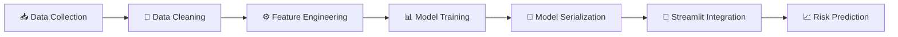
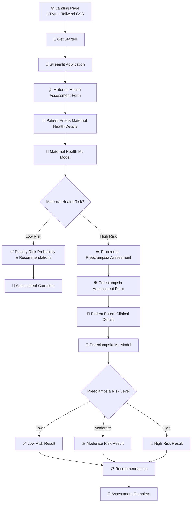

# 🏥 Maternal Health & Preeclampsia Risk Prediction System

<div align="center">

### AI-Powered Healthcare Risk Assessment Platform

Predict maternal health complications and preeclampsia risk using Machine Learning and an interactive healthcare dashboard.

<br>


<br><br>

## 🚀 Live Demo

🌐 **Landing Page**  
https://guileless-ganache-2ac578.netlify.app/

🏥 **Streamlit Application**  
https://maternal-health-preeclampsia-system.onrender.com/

</div>

---

# 🌟 Project Overview

The **Maternal Health & Preeclampsia Risk Prediction System** is an end-to-end Machine Learning healthcare application developed to assist in the early identification of maternal health risks and preeclampsia complications during pregnancy.

The application follows a **two-stage prediction workflow**:

### Phase 1: Maternal Health Risk Assessment

Evaluates overall maternal health risk using pregnancy and medical parameters.

### Phase 2: Preeclampsia Risk Assessment

If high maternal health risk is detected, the user proceeds to a secondary assessment for preeclampsia prediction.

The system provides:

- Maternal Health Risk Prediction
- Preeclampsia Risk Prediction
- Probability-Based Analysis
- Personalized Healthcare Recommendations
- Interactive Dashboard
- Responsive User Interface

---

# 🎯 Problem Statement

Maternal health complications remain one of the leading causes of pregnancy-related mortality worldwide.

Among these complications, **Preeclampsia** is a serious condition characterized by high blood pressure and potential organ damage during pregnancy.

Challenges include:

- Late diagnosis
- Limited healthcare access
- Inadequate monitoring
- Delayed intervention

This project leverages Machine Learning to support early risk assessment and healthcare awareness.

---

# 🎯 Objectives

- Predict maternal health risk using clinical indicators.
- Identify patients at high risk for preeclampsia.
- Assist healthcare awareness through predictive analytics.
- Provide probability-based risk interpretation.
- Demonstrate practical Machine Learning deployment.
- Create an accessible healthcare screening interface.

---

# 🚀 Key Features

## ✅ Maternal Health Prediction

Predicts maternal health risk using pregnancy-related and medical attributes.

## ✅ Preeclampsia Prediction

Provides secondary risk assessment when high maternal risk is detected.

## ✅ Probability Analysis

Displays prediction confidence scores.

## ✅ Personalized Recommendations

Offers recommendations based on risk level.

## ✅ Multi-Step Workflow

Implements intelligent conditional assessment.

## ✅ Interactive Dashboard

Built using Streamlit.

## ✅ Professional Landing Page

Built using:

- HTML5
- Tailwind CSS
- JavaScript

## ✅ Responsive Design

Supports:

- Desktop
- Laptop
- Tablet
- Mobile

---

# 🧠 Machine Learning Pipeline

### 1️⃣ Data Collection

Healthcare-related maternal datasets were collected and analyzed.

### 2️⃣ Data Cleaning

Performed:

- Missing value handling
- Data validation
- Categorical conversion
- Data preprocessing

### 3️⃣ Feature Engineering

Prepared features for Machine Learning models.

### 4️⃣ Model Training

Classification models were trained for:

- Maternal Health Prediction
- Preeclampsia Prediction

### 5️⃣ Model Evaluation

Models were evaluated using performance metrics.

### 6️⃣ Model Serialization

Saved using Joblib (`.pkl`).

### 7️⃣ Deployment

Integrated into Streamlit application.

---

# 🧠 Machine Learning Pipeline Diagram



---

# 📊 Input Parameters

## 🩺 Maternal Health Features

| Feature | Description |
|----------|-------------|
| Age | Patient age |
| Gravida | Number of pregnancies |
| Weight | Body weight |
| Height | Height |
| Gestation Period | Pregnancy duration |
| Blood Pressure | Systolic & Diastolic BP |
| Anemia | Anemia condition |
| Albumin | Urine albumin status |
| Blood Sugar | Blood sugar level |
| Fetal Position | Baby position |
| Fetal Heart Beat | Fetal heart rate |
| Jaundice | Liver condition |
| VDRL | Infection indicator |
| HRsAG | Hepatitis indicator |

---

## 🫀 Preeclampsia Features

| Feature | Description |
|----------|-------------|
| Age | Patient age |
| Blood Pressure | Systolic & Diastolic BP |
| BMI | Body Mass Index |
| Blood Sugar | Blood glucose level |
| Body Temperature | Temperature |
| Heart Rate | Heart rate |
| Previous Complications | Pregnancy history |
| Diabetes History | Diabetes indicators |
| Mental Health | Mental health condition |

---

# 🏗️ System Architecture



---

# 🔄 Application Workflow

```mermaid
flowchart LR

    User[👩 Patient]
    Landing[🌐 Landing Page]
    Streamlit[🏥 Streamlit App]

    Maternal[🩺 Maternal Assessment]
    MaternalModel[🤖 Maternal ML Model]

    Decision{High Risk?}

    Preeclampsia[🫀 Preeclampsia Assessment]
    PreeModel[🤖 Preeclampsia ML Model]

    Result[📊 Prediction Result]
    Advice[📋 Recommendations]

    User --> Landing
    Landing --> Streamlit
    Streamlit --> Maternal
    Maternal --> MaternalModel
    MaternalModel --> Decision

    Decision -->|No| Result

    Decision -->|Yes| Preeclampsia
    Preeclampsia --> PreeModel
    PreeModel --> Result

    Result --> Advice
```



---

# 🛠️ Technology Stack

## Frontend

- HTML5
- Tailwind CSS
- JavaScript

## Backend

- Python
- Streamlit

## Machine Learning

- Scikit-learn
- Pandas
- NumPy
- Joblib

## Development Tools

- VS Code
- Git
- GitHub

---

# 📂 Project Structure

```bash
maternal-health-preeclampsia-system/
│
├── .streamlit/
│   └── config.toml
│
├── .vscode/
│   └── settings.json
│
├── app/
│   ├── models/
│   │   ├── loader.py
│   │   ├── maternal_health_model.pkl
│   │   └── preeclampsia_model.pkl
│   │
│   ├── static/
│   │   └── index.html
│   │
│   ├── app.py
│   └── doctor_advice.json
│
├── .gitignore
├── .python-version
├── pyproject.toml
├── README.md
├── render.yaml
└── uv.lock
```

## 📁 Directory Description

| File / Folder | Description |
|--------------|-------------|
| `.streamlit/config.toml` | Streamlit configuration settings |
| `.vscode/settings.json` | VS Code workspace settings |
| `app/app.py` | Main Streamlit application |
| `app/doctor_advice.json` | Risk thresholds and recommendation messages |
| `app/models/loader.py` | Model loading utility |
| `app/models/maternal_health_model.pkl` | Trained maternal health prediction model |
| `app/models/preeclampsia_model.pkl` | Trained preeclampsia prediction model |
| `app/static/index.html` | Landing page (HTML + Tailwind CSS) |
| `.gitignore` | Git ignored files |
| `.python-version` | Python version configuration |
| `pyproject.toml` | Project dependencies and metadata |
| `render.yaml` | Render deployment configuration |
| `uv.lock` | Locked dependency versions |
| `README.md` | Project documentation |

---

# 📚 Learning Outcomes

- End-to-End Machine Learning Workflow
- Healthcare Data Analytics
- Feature Engineering
- Model Deployment
- Streamlit Development
- Frontend + Backend Integration
- GitHub Project Management
- Healthcare AI Applications

---

# ⚠️ Medical Disclaimer

This application is developed for educational and research purposes only.

The predictions generated by the system should not be considered medical advice, diagnosis, or treatment recommendations.

Patients should always consult qualified healthcare professionals for medical decisions.
